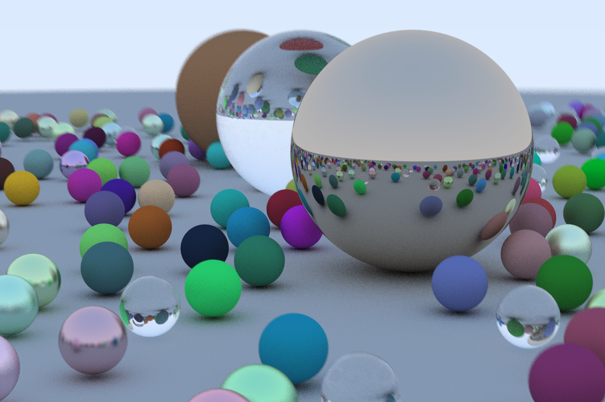

# rs-ray-tracer

Rust implementation of "Ray Tracing in One Weekend" by Peter Shirley. Created as a first project to learn Rust.

## Features

- Completes all features in the book
- Parallelized with Rayon

## Limitations

- Only outputs to PPM currently
- Was my first Rust project, so it is not the most idiomatic Rust code

## Resources

- [Ray Tracing in One Weekend](https://raytracing.github.io/books/RayTracingInOneWeekend.html)
